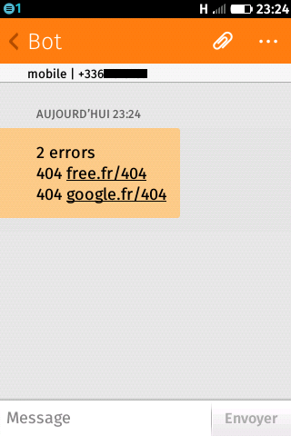

down-checker
============

Sends SMS notifications with the Free Mobile API when one of your websites is down. If no website is down, you won't
be notified.

# How to

* Enable the option on the [Free Mobile website](https://mobile.free.fr/moncompte/index.php?page=options).
* Add your Free Mobile API's credentials (file __launcher.php__ : `const USER` and `const PASSWORD`).
* Add your websites (file __launcher.php__ : `public static $websites`).
* Launch with `php launcher.php` or `php launcher.php > output.log`.

# Configure a cron job

Add an entry to your crontab (with `crontab -e`). Example :

    */15 * * * * php /path/to/down-checker/launcher.php > /path/to/cron/down-checker/output.log
    
The cron job will be executed each 15 minutes.

# Example

#### Configuration :

    public static $websites = array(
        'inck.fr',
        'free.fr/404',
        'smaltcreation.fr',
        'google.fr/404',
        'smaltcreation.com',
    );

#### Output :

    09/10/2014 23:24:07
    200 inck.fr
    404 free.fr/404
    200 smaltcreation.fr
    404 google.fr/404
    200 smaltcreation.com
    Sending notification
    Notification sent

#### Received notification :

    2 errors
    404 free.fr/404
    404 google.fr/404
